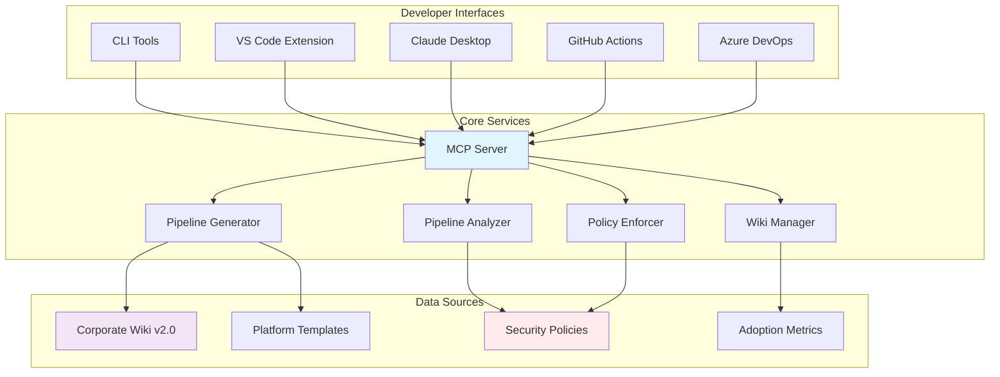
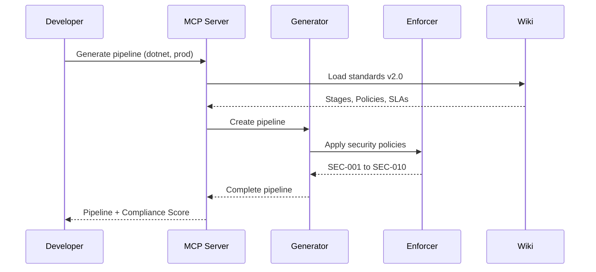
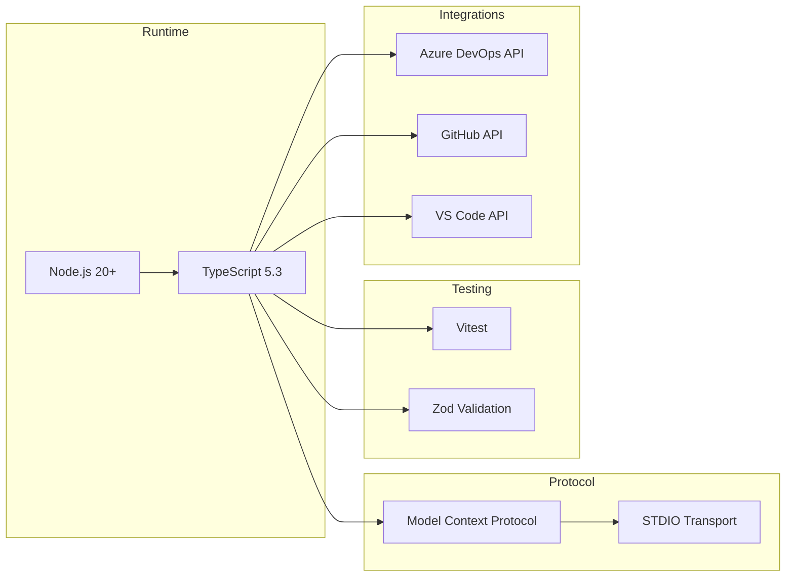

# Pipeline Assistant MCP

[](LICENSE)
[](https://www.typescriptlang.org/)
[](https://nodejs.org/)
[](tests/)
[](wiki/standards/)

> **AI-powered CI/CD pipeline automation using Model Context Protocol (MCP)**

Transform pipeline creation from hours to seconds with guaranteed security compliance and DevSecOps best practices built-in.

---

## What is Pipeline Assistant MCP?

Pipeline Assistant MCP is an intelligent system that automates the complete CI/CD pipeline lifecycle using AI. It leverages the [Model Context Protocol (MCP)](https://modelcontextprotocol.io) to provide context-aware pipeline generation, analysis, and improvement suggestions.

**It's not just a validation tool** - it's a complete DevSecOps assistant that:
- Generates production-ready pipelines from templates
- Enforces corporate security policies automatically
- Analyzes existing pipelines for vulnerabilities
- Provides actionable improvement suggestions
- Tracks compliance metrics across your organization

---

## Why Pipeline Assistant MCP?

### The Problem

```
Developer: "I need to create a pipeline for my .NET microservice"

2-4 hours later...
- Forgot security scanning stage
- Hardcoded database credentials
- Didn't configure dependency caching
- Tests don't generate coverage reports
- Deploys directly to production without approval

Result: Insecure, slow, non-compliant pipeline
```

### The Solution

```
Developer: "Generate a .NET pipeline for production"

5 seconds later...
- Complete 6-stage pipeline generated
- All 10 security policies applied (SEC-001 to SEC-010)
- Optimized caching configured
- Tests with coverage reporting
- Production deployment with approval gates
- SBOM generation included
- Compliance Score: 98%

Result: Production-ready, secure, compliant pipeline
```

### Business Value

| Metric | Before | After | Improvement |
|--------|--------|-------|-------------|
| Pipeline creation time | 2-4 hours | 5 seconds | **99.9% faster** |
| Security compliance | ~40% | 95%+ | **+55%** |
| Vulnerability detection | Manual review | Automatic | **Real-time** |
| Standards adoption | Inconsistent | Enforced | **100% coverage** |

---

## Architecture

### System Overview



### Component Interaction



### Technology Stack



---

## Features

### Core Capabilities

- **Multi-Platform Support** - Generate pipelines for Azure DevOps and GitHub Actions
- **Pipeline Generation** - Create complete pipelines from templates (.NET, Node.js, Python, Java, Go)
- **Security Analysis** - Detect hardcoded secrets, missing security stages, 15+ vulnerability types
- **Policy Enforcement** - Automatically apply SEC-001 to SEC-010 security policies
- **Compliance Scoring** - Calculate 0-100 scores with detailed breakdowns
- **SBOM Generation** - Software Bill of Materials for supply chain security

### Integrations

- **VS Code Extension** - Real-time analysis, quick fixes, 35+ snippets
- **Claude Desktop** - Natural language pipeline generation via MCP
- **GitHub Actions** - Automatic PR analysis workflow
- **Azure DevOps** - PR Bot with webhook support

### Security Features

- **Webhook Signature Validation** - HMAC-SHA256 with timing-safe comparison
- **Secret Masking** - Automatic redaction of tokens, passwords, API keys
- **Rate Limiting** - Sliding window algorithm to prevent abuse
- **Input Validation** - Zod schemas for all user inputs

---

## Quick Start

### Prerequisites

- Node.js 20+ and npm 9+
- Git

### Installation

```bash
git clone https://github.com/soydachi/pipeline-assistant-mcp.git
cd pipeline-assistant-mcp
npm install
npm run build
npm test
```

### Basic Usage

```bash
# Generate a pipeline for Azure DevOps
node dist/cli/pipeline-assistant.js generate \
  --platform azure-devops \
  --type dotnet \
  --env production

# Generate a pipeline for GitHub Actions
node dist/cli/pipeline-assistant.js generate \
  --platform github-actions \
  --type node \
  --env staging

# Analyze a pipeline
node dist/cli/pipeline-assistant.js analyze \
  examples/pipelines/pipeline-con-problemas.yml

# List available platforms
node dist/cli/pipeline-assistant.js platforms

# List available templates
node dist/cli/pipeline-assistant.js templates --platform azure-devops
```

---

## Project Structure

```
pipeline-assistant-mcp/
├── src/                          # Core MCP server
│   ├── server.ts                 # MCP server entry point
│   ├── pipeline-generator.ts     # Pipeline generation
│   ├── pipeline-analyzer.ts      # Security analysis
│   ├── policy-enforcer.ts        # Policy enforcement
│   ├── wiki-parser.ts            # Standards parser
│   ├── wiki-manager.ts           # Wiki management
│   ├── container.ts              # Dependency injection
│   ├── platforms/                # Multi-platform support
│   │   ├── azure-devops.ts
│   │   └── github-actions.ts
│   ├── azure-devops/             # Azure DevOps integration
│   │   ├── client.ts
│   │   ├── pr-bot.ts
│   │   └── webhook-handler.ts
│   └── utils/                    # Shared utilities
│       ├── logger.ts
│       ├── validation.ts
│       └── rate-limiter.ts
├── cli/                          # Command-line tools
│   ├── pipeline-assistant.ts
│   ├── wiki-cli.ts
│   └── pr-bot-cli.ts
├── vscode-extension/             # VS Code extension
├── wiki/standards/               # Corporate standards v2.0
│   ├── core/                     # Stage definitions
│   ├── security/                 # Security policies
│   ├── quality/                  # Quality gates
│   ├── platforms/                # Platform templates
│   │   ├── azure/templates/
│   │   └── github/templates/
│   ├── migration/                # Migration guides
│   └── governance/               # Governance docs
├── tests/                        # Test suite (341+ tests)
└── examples/                     # Example pipelines
```

---

## Documentation

| Document | Description |
|----------|-------------|
| [Workshop Guide](docs/WORKSHOP.md) | Complete tutorial with architecture deep-dive |
| [Usage Guide](docs/USAGE.md) | Reference for all platforms and configurations |
| [Contributing](CONTRIBUTING.md) | How to contribute to the project |
| [Changelog](CHANGELOG.md) | Version history and release notes |

---

## Integrations

### MCP Server (Claude Desktop)

```json
{
  "mcpServers": {
    "pipeline-assistant": {
      "command": "node",
      "args": ["dist/src/server.js"],
      "cwd": "/path/to/pipeline-assistant-mcp"
    }
  }
}
```

### VS Code Extension

```bash
cd vscode-extension
npm install && npm run compile
# Press F5 to launch in development mode
```

### Azure DevOps

```bash
export AZDO_ORG_URL="https://dev.azure.com/your-org"
export AZDO_PAT="your-personal-access-token"
export AZDO_PROJECT="your-project"
```

### GitHub Actions

Add `.github/workflows/pipeline-review.yml` to automatically analyze PRs.

See [Usage Guide](docs/USAGE.md) for detailed configuration.

---

## Standards v2.0

Pipeline Assistant uses a structured standards system:

### Security Policies (SEC-001 to SEC-010)

| Policy | Name | Level |
|--------|------|-------|
| SEC-001 | Secret Scanning | Mandatory |
| SEC-002 | SAST Analysis | Mandatory |
| SEC-003 | Dependency Scanning | Mandatory |
| SEC-004 | Container Scanning | Conditional |
| SEC-007 | DAST | Conditional |
| SEC-008 | License Compliance | Mandatory |
| SEC-010 | SBOM Generation | Mandatory |

### Mandatory Pipeline Stages

1. **Validate** - Linting, formatting, type checking
2. **Security** - All security scans (parallel)
3. **Build** - Application build + SBOM
4. **Test** - Unit + Integration tests
5. **Scan** - Container security
6. **Deploy** - Environment deployments

---

## Development

```bash
npm run dev          # Watch mode
npm test             # Run tests (341+ tests)
npm run lint         # Check code style
npm run build        # Build project
```

### Testing

```bash
# Run all tests
npm test

# Run specific test
npx vitest run tests/policy-enforcer.test.ts

# Run with coverage
npx vitest run --coverage
```

---

## Contributing

We welcome contributions! Please see [CONTRIBUTING.md](CONTRIBUTING.md) for guidelines.

---

## License

[Apache License 2.0](LICENSE)

---

## Author

**Dachi Gogotchuri** ([@soydachi](https://github.com/soydachi))

- Website: [soydachi.com](https://soydachi.com)
- LinkedIn: [Dachi Gogotchuri](https://linkedin.com/in/soydachi)
