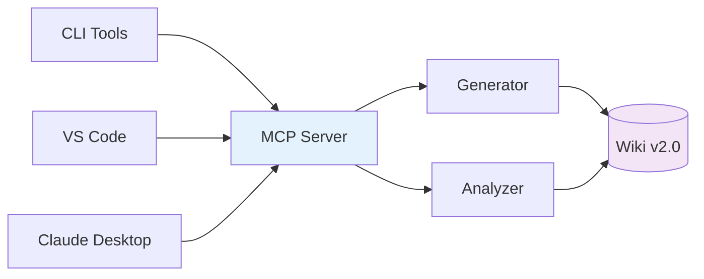

# Usage Guide

Complete reference for setting up and using Pipeline Assistant MCP across all platforms.

## Quick Architecture Reference



## Table of Contents

- [CLI Tools](#cli-tools)
- [MCP Server (Claude)](#mcp-server-claude)
- [VS Code Extension](#vs-code-extension)
- [GitHub Integration](#github-integration)
- [Azure DevOps Integration](#azure-devops-integration)
- [Configuration](#configuration)
- [Security Features](#security-features)
- [Examples](#examples)
- [Troubleshooting](#troubleshooting)

---

## CLI Tools

Pipeline Assistant provides three CLI tools:

### Pipeline Assistant

Main tool for generating and analyzing pipelines.

```bash
# Generate pipeline (platform required)
node dist/cli/pipeline-assistant.js generate \
  --platform <azure-devops|github-actions> \
  --type <dotnet|node|python|java|go> \
  --env <dev|staging|production> \
  --services <redis,azuresql,keyvault,cosmosdb,servicebus,storage> \
  --output <filename.yml>

# Analyze pipeline
node dist/cli/pipeline-assistant.js analyze \
  --file <pipeline.yml> \
  --strict

# Get suggestions
node dist/cli/pipeline-assistant.js suggest \
  --file <pipeline.yml> \
  --focus <security|performance|compliance|quality>

# List available platforms
node dist/cli/pipeline-assistant.js platforms

# List available templates
node dist/cli/pipeline-assistant.js templates --platform azure-devops

# List available services
node dist/cli/pipeline-assistant.js services
```

### Wiki CLI

Manage corporate standards and metrics.

```bash
# List standards
node dist/cli/wiki-cli.js standards --list

# List templates
node dist/cli/wiki-cli.js templates --list

# View metrics
node dist/cli/wiki-cli.js metrics --current

# Generate report
node dist/cli/wiki-cli.js metrics --report markdown --export report.md

# Watch for changes
node dist/cli/wiki-cli.js watch --interval 60000
```

### PR Bot CLI

Analyze pull requests and simulate scenarios.

```bash
# Simulate analysis
node dist/cli/pr-bot-cli.js simulate --scenario <good|bad|mixed>

# Analyze GitHub PR
node dist/cli/pr-bot-cli.js analyze \
  --owner <org> \
  --repo <repo> \
  --pr <number> \
  --token $GITHUB_TOKEN \
  --dry-run
```

---

## MCP Server (Claude)

### Claude Desktop Configuration

Add to your Claude Desktop config (`claude_desktop_config.json`):

**macOS:** `~/Library/Application Support/Claude/claude_desktop_config.json`
**Windows:** `%APPDATA%\Claude\claude_desktop_config.json`

```json
{
  "mcpServers": {
    "pipeline-assistant": {
      "command": "node",
      "args": ["dist/src/server.js"],
      "cwd": "/absolute/path/to/pipeline-assistant-mcp",
      "transport": "stdio"
    }
  }
}
```

### Available Tools

The MCP server exposes three tools:

| Tool | Description |
|------|-------------|
| `generate_pipeline` | Generate new pipeline from templates |
| `analyze_pipeline` | Analyze existing pipeline for issues |
| `suggest_improvements` | Get improvement suggestions |

### Example Prompts

- "Generate a Node.js pipeline with Redis and Azure SQL for production"
- "Analyze this pipeline and find security issues"
- "Suggest performance improvements for my pipeline"

---

## VS Code Extension

### Installation

1. Open the `vscode-extension/` directory
2. Run `npm install && npm run compile`
3. Press F5 to launch extension in development mode

Or package and install:
```bash
cd vscode-extension
npm run package
code --install-extension pipeline-assistant-*.vsix
```

### Features

- **Real-time Analysis** - Issues appear as you type
- **Quick Fixes** - One-click fixes for common problems
- **35+ Snippets** - Type `stage-` to see available snippets
- **Wiki Viewer** - View standards in sidebar

### Commands

- `Pipeline Assistant: Generate` - Generate new pipeline
- `Pipeline Assistant: Analyze` - Analyze current file
- `Pipeline Assistant: Show Wiki` - Open standards viewer

### Settings

```json
{
  "pipelineAssistant.mcpServerPath": "/path/to/dist/src/server.js",
  "pipelineAssistant.wikiPath": "./wiki/standards",
  "pipelineAssistant.enableAutoAnalysis": true,
  "pipelineAssistant.strictMode": false
}
```

---

## GitHub Integration

### GitHub Action Setup

Create `.github/workflows/pipeline-review.yml`:

```yaml
name: Pipeline Review

on:
  pull_request:
    paths:
      - '**.yml'
      - '**.yaml'

jobs:
  analyze:
    runs-on: ubuntu-latest
    steps:
      - uses: actions/checkout@v4
      - uses: actions/setup-node@v4
        with:
          node-version: '20'

      - name: Install Pipeline Assistant
        run: npm install -g @soydachi/pipeline-assistant-mcp

      - name: Analyze Pipelines
        env:
          GITHUB_TOKEN: ${{ secrets.GITHUB_TOKEN }}
        run: |
          pipeline-pr analyze \
            --owner ${{ github.repository_owner }} \
            --repo ${{ github.event.repository.name }} \
            --pr ${{ github.event.pull_request.number }} \
            --mode enforcement
```

### Features

- Automatic analysis on PR creation
- Inline comments on exact lines
- Re-analysis with `/reanalyze` comment
- Compliance score badges

---

## Azure DevOps Integration

### Configuration

Set environment variables:

```bash
export AZDO_ORG_URL="https://dev.azure.com/your-organization"
export AZDO_PAT="your-personal-access-token"
export AZDO_PROJECT="YourProject"
export AZDO_REPOSITORY="your-repo"  # Optional
```

Or use a JSON config file:

```json
{
  "organizationUrl": "https://dev.azure.com/your-org",
  "personalAccessToken": "your-pat",
  "project": "YourProject",
  "repository": "your-repo",
  "enforcementMode": "learning",
  "strictMode": false,
  "retryPolicy": {
    "maxRetries": 3,
    "retryDelayMs": 1000,
    "backoffMultiplier": 2
  }
}
```

### PAT Permissions

Required scopes for Personal Access Token:
- Code: Read & Write
- Work Items: Read & Write
- Build: Read
- Pull Request Threads: Read & Write

### Usage

```bash
# Analyze PR
node dist/cli/azure-devops-cli.js analyze-pr --pr 123

# With inline comments
node dist/cli/azure-devops-cli.js analyze-pr \
  --pr 123 \
  --post-comments \
  --mode learning

# Enforcement mode (blocks merge)
node dist/cli/azure-devops-cli.js analyze-pr \
  --pr 123 \
  --post-comments \
  --update-status \
  --mode enforcement \
  --min-score 80
```

### Webhook Setup

1. Go to Project Settings > Service Hooks
2. Create subscription for "Pull request created/updated"
3. Configure webhook URL to your server
4. Set webhook secret for signature validation

#### Webhook Handler Configuration

```typescript
const handler = new WebhookHandler(bot, config, {
  validateSignature: true,
  webhookSecret: process.env.WEBHOOK_SECRET,
  autoAnalyze: true,
  rateLimitEnabled: true,
  rateLimitPerMinute: 30
});
```

---

## Security Features

### Webhook Signature Validation

All incoming webhooks can be validated using HMAC-SHA256:

```typescript
// Signature format: sha256=<hash>
const isValid = handler.validateWebhookSignature(payload, signature);
```

### Secret Masking in Logs

Sensitive data is automatically redacted:
- Passwords, tokens, API keys
- Bearer tokens
- Basic auth credentials
- JWT tokens
- URLs with embedded credentials

### Rate Limiting

Built-in rate limiting for webhooks and API endpoints:

```typescript
import { createWebhookRateLimiter, createRateLimitHeaders } from './utils/rate-limiter';

const limiter = createWebhookRateLimiter({ maxRequests: 30 });
const result = limiter.checkLimit(clientId);

if (!result.allowed) {
  return res.status(429).json({ error: 'Rate limit exceeded' });
}
```

### Input Validation

All inputs are validated using Zod schemas:

```typescript
import { validateAnalyzeInput, validateGenerateInput } from './utils/validation';

const input = validateAnalyzeInput(userInput);
```

---

## Configuration

### Custom Rules

Create `config.json`:

```json
{
  "enforcement": {
    "mode": "strict",
    "blockOnCritical": true,
    "requireMinScore": 80
  },
  "customRules": [
    {
      "id": "CUSTOM-001",
      "pattern": "todo|fixme",
      "severity": "MEDIUM",
      "message": "Resolve TODO comments before committing"
    }
  ],
  "excludedPaths": [
    "**/node_modules/**",
    "**/dist/**"
  ]
}
```

### Corporate Standards (v2.0)

Standards are organized in a structured directory:

```
wiki/standards/
├── core/                    # Stage definitions
│   ├── stages.yaml          # Mandatory 6-stage structure
│   ├── naming-conventions.yaml
│   └── environments.yaml
├── security/                # Security policies
│   ├── policies.yaml        # SEC-001 to SEC-010
│   ├── sla.yaml             # Remediation SLAs
│   └── compliance-mapping.yaml
├── quality/                 # Quality standards
│   ├── testing.yaml
│   ├── coverage.yaml
│   └── gates.yaml           # Quality gate thresholds
├── platforms/               # Platform templates
│   ├── azure/templates/     # Azure DevOps templates
│   └── github/templates/    # GitHub Actions templates
├── migration/               # Migration guides
└── governance/              # Governance documentation
```

Key configuration files:
- `security/policies.yaml` - Security policy definitions (SEC-001 to SEC-010)
- `core/stages.yaml` - Mandatory pipeline stages
- `quality/gates.yaml` - Quality gate thresholds per environment

---

## Examples

### Example Pipelines

Located in `examples/pipelines/`:

| File | Description |
|------|-------------|
| `pipeline-con-problemas.yml` | Pipeline with intentional issues |
| `pipeline-arreglado.yml` | Corrected version |

### Test the Examples

```bash
# Analyze bad pipeline
node dist/cli/pipeline-assistant.js analyze \
  examples/pipelines/pipeline-con-problemas.yml

# Expected: Score ~25%, multiple critical issues

# Analyze good pipeline
node dist/cli/pipeline-assistant.js analyze \
  examples/pipelines/pipeline-arreglado.yml

# Expected: Score ~95%, no critical issues
```

### Generate Different Project Types

```bash
# .NET with Azure services for Azure DevOps
node dist/cli/pipeline-assistant.js generate \
  --platform azure-devops \
  --type dotnet \
  --services redis,azuresql,keyvault \
  --env production

# Node.js basic for GitHub Actions
node dist/cli/pipeline-assistant.js generate \
  --platform github-actions \
  --type node \
  --env dev

# Python with Service Bus for Azure DevOps
node dist/cli/pipeline-assistant.js generate \
  --platform azure-devops \
  --type python \
  --services servicebus,storage \
  --env staging
```

---

## Troubleshooting

### Common Issues

**Build fails**
```bash
npm run clean && npm run build
```

**Tests fail**
```bash
npm test -- --verbose
```

**MCP server won't connect**
- Check path in Claude config is absolute
- Verify Node.js is in PATH
- Check Output panel in VS Code
- Ensure project is built (`npm run build`)

**Azure DevOps authentication fails**
- Verify PAT has required permissions
- Check organization URL format
- Ensure PAT is not expired
- Test with: `curl -u :$AZDO_PAT "$AZDO_ORG_URL/_apis/projects?api-version=7.0"`

**Rate limiting issues**
- Check if your client ID is consistent
- Verify rate limit configuration
- Reset rate limit if needed: `handler.resetRateLimit(clientId)`

### Getting Help

- [GitHub Issues](https://github.com/soydachi/pipeline-assistant-mcp/issues)
- Check existing tests for usage examples
- Review `examples/` directory
- See [Workshop Guide](WORKSHOP.md) for step-by-step tutorial
