# Pipeline Assistant MCP - Workshop Guide

> **Interactive Workshop**: Intelligent CI/CD Pipeline Generation with AI
>
> **Duration**: 90-120 minutes
> **Level**: Beginner to Intermediate
> **Author**: Dachi Gogotchuri (@soydachi)

---

## Table of Contents

1. [Introduction](#1-introduction)
2. [Architecture Deep Dive](#2-architecture-deep-dive)
3. [Core Concepts](#3-core-concepts)
4. [Environment Setup](#4-environment-setup)
5. [Lab 1: Pipeline Generation](#5-lab-1-pipeline-generation)
6. [Lab 2: Pipeline Analysis](#6-lab-2-pipeline-analysis)
7. [Lab 3: Wiki & Standards Management](#7-lab-3-wiki--standards-management)
8. [Lab 4: VS Code Extension](#8-lab-4-vs-code-extension)
9. [Lab 5: MCP Server Integration](#9-lab-5-mcp-server-integration)
10. [Lab 6: Azure DevOps Integration](#10-lab-6-azure-devops-integration)
11. [Lab 7: GitHub Integration](#11-lab-7-github-integration)
12. [Advanced Topics](#12-advanced-topics)
13. [Next Steps](#13-next-steps)

---

## 1. Introduction

### What is Pipeline Assistant MCP?

**Pipeline Assistant MCP** is an intelligent system that automates the complete CI/CD pipeline lifecycle using AI. Built on the [Model Context Protocol (MCP)](https://modelcontextprotocol.io), it provides context-aware pipeline generation, security analysis, and compliance enforcement.

### Key Capabilities

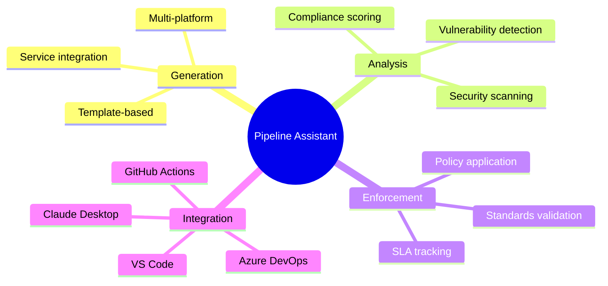

### The Problem It Solves

**Traditional Pipeline Creation:**

```
Developer: "I need to create a pipeline for my .NET microservice"

2-4 hours later...
- Forgot security scanning stage
- Hardcoded database credentials
- Didn't configure NuGet cache
- Tests don't generate coverage
- Deploys directly to production without approval

Result: Insecure, slow, non-compliant pipeline
```

**With Pipeline Assistant:**

```
Developer: "Generate a .NET pipeline for production"

5 seconds later...
- Complete 6-stage pipeline generated
- All 10 security policies applied (SEC-001 to SEC-010)
- Optimized caching configured
- Tests with coverage reporting
- Production deployment with approval gates
- SBOM generation included
- Compliance Score: 98%

Result: Production-ready, secure, compliant pipeline
```

### Why It Matters

| Challenge | Traditional Approach | With Pipeline Assistant |
|-----------|---------------------|------------------------|
| **Time to create** | 2-4 hours manual work | 5 seconds automated |
| **Security coverage** | Inconsistent, often missed | 100% policy enforcement |
| **Compliance** | Manual audits | Automatic scoring |
| **Updates** | Manual propagation | Centralized standards |
| **Knowledge sharing** | Tribal knowledge | Codified in wiki |

### Business Value

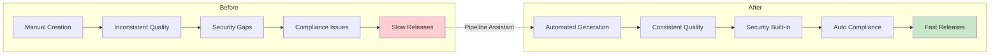

---

## 2. Architecture Deep Dive

### System Architecture

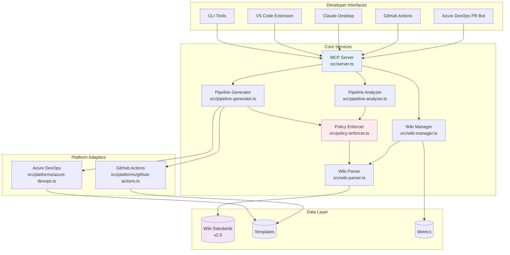

### Component Responsibilities

| Component | File | Responsibility |
|-----------|------|----------------|
| **MCP Server** | `src/server.ts` | Entry point, tool registration, request routing |
| **Pipeline Generator** | `src/pipeline-generator.ts` | Create pipelines from templates |
| **Pipeline Analyzer** | `src/pipeline-analyzer.ts` | Security and compliance analysis |
| **Policy Enforcer** | `src/policy-enforcer.ts` | Apply security policies (SEC-001 to SEC-010) |
| **Wiki Parser** | `src/wiki-parser.ts` | Parse YAML standards files |
| **Wiki Manager** | `src/wiki-manager.ts` | Standards and metrics management |
| **Platform Adapters** | `src/platforms/` | Platform-specific syntax generation |

### Data Flow: Pipeline Generation

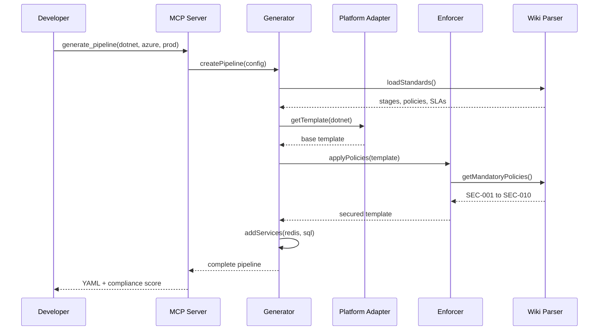

### Data Flow: Pipeline Analysis

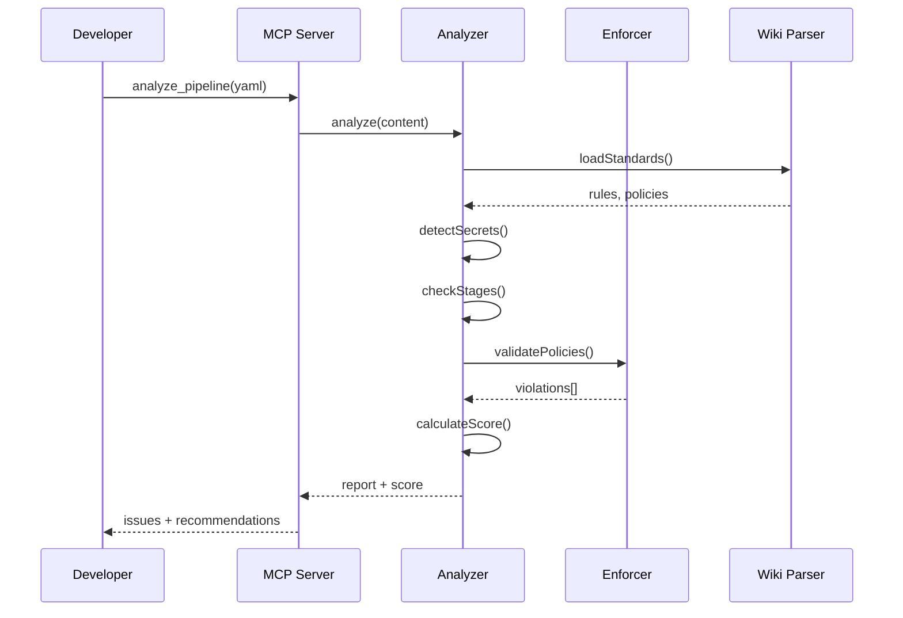

### Technology Stack

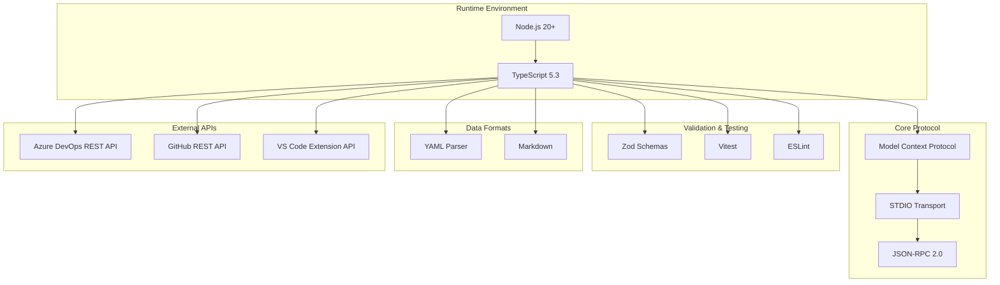

---

## 3. Core Concepts

### Model Context Protocol (MCP)

MCP is an open protocol that standardizes how AI applications connect to external data sources and tools. Pipeline Assistant uses MCP to:

- Expose pipeline tools to AI assistants (Claude)
- Provide contextual information about standards
- Enable natural language pipeline generation

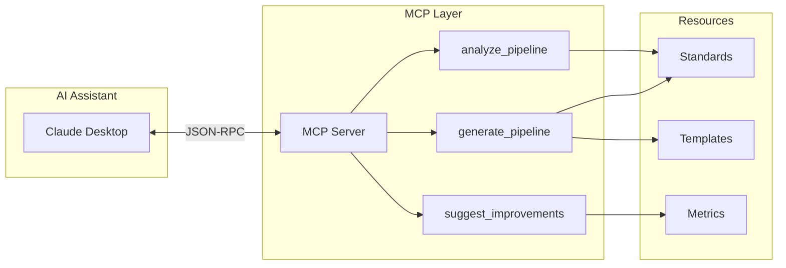

### Standards v2.0 Structure

Pipeline Assistant uses a structured wiki for corporate standards:

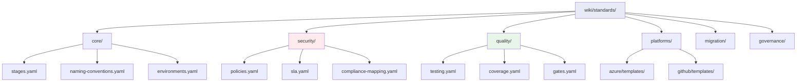

### Security Policies

Ten mandatory/conditional security policies enforce DevSecOps best practices:

| Policy | Name | Stage | Condition |
|--------|------|-------|-----------|
| SEC-001 | Secret Scanning | Security | Always |
| SEC-002 | SAST Analysis | Security | Always |
| SEC-003 | Dependency Scanning | Security | Always |
| SEC-004 | Container Scanning | Scan | usesDocker |
| SEC-005 | IaC Security | Security | hasInfraCode |
| SEC-006 | API Security | Security | isApiProject |
| SEC-007 | DAST | Deploy | hasWebInterface |
| SEC-008 | License Compliance | Security | Always |
| SEC-009 | Code Signing | Build | isProduction |
| SEC-010 | SBOM Generation | Build | Always |

### Policy Enforcement Model

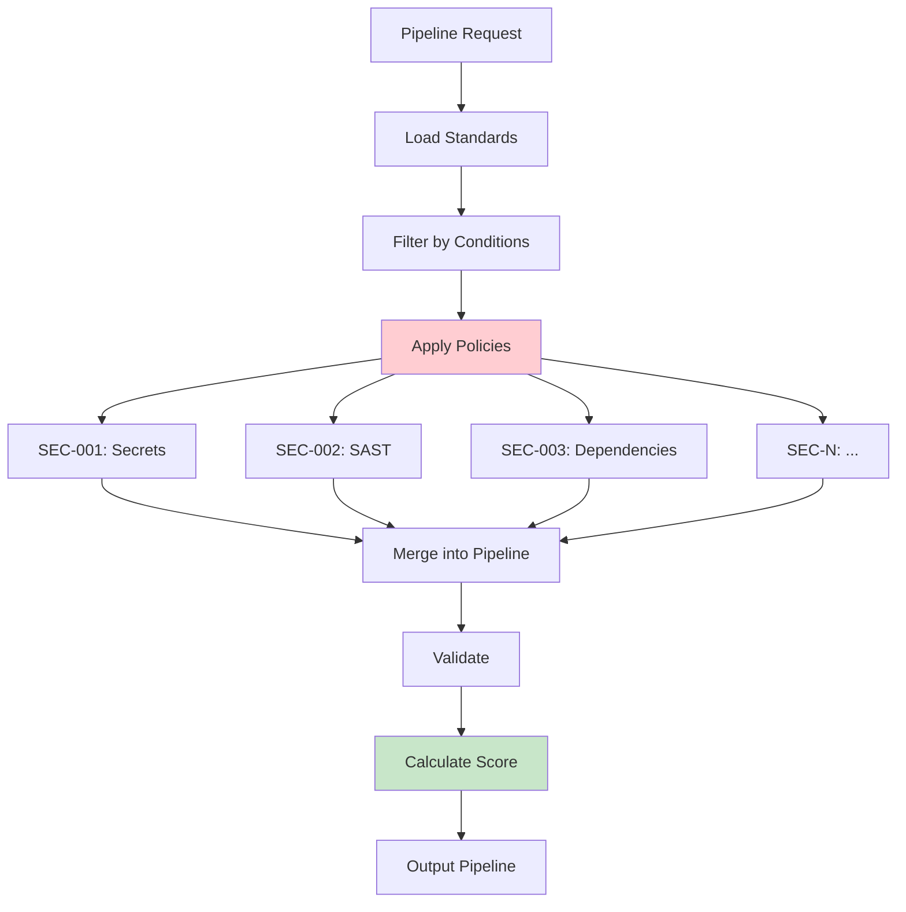

### Mandatory Pipeline Stages

Every generated pipeline follows a 6-stage structure:

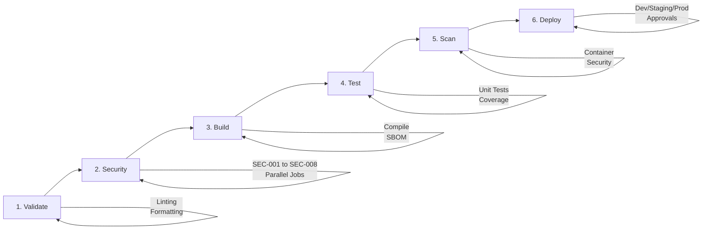

---

## 4. Environment Setup

### Prerequisites

Before starting, verify you have:

```bash
# Check Node.js (>= 20.0.0)
node --version
# Expected: v20.x.x or higher

# Check npm (>= 9.0.0)
npm --version
# Expected: 9.x.x or higher

# Check Git
git --version
# Expected: 2.x.x or higher
```

### Step 1: Clone the Repository

```bash
# Clone the project
git clone https://github.com/soydachi/pipeline-assistant-mcp.git

# Enter the directory
cd pipeline-assistant-mcp

# View the structure
ls -la
```

**Project structure:**
```
src/                  # Source code
cli/                  # CLI tools
vscode-extension/     # VS Code extension
wiki/standards/       # Corporate standards v2.0
tests/                # Test suite (341+ tests)
docs/                 # Documentation
  examples/           # Example pipelines (problematic & correct)
```

### Step 2: Install Dependencies

```bash
npm install
```

**Expected output:**
```
added 234 packages in 15s
```

### Step 3: Build the Project

```bash
npm run build
```

**What this does:**
1. Clears previous `dist/` directory
2. Runs TypeScript compiler (`tsc`)
3. Generates JavaScript in `dist/`

### Step 4: Run Tests

```bash
npm test
```

**Expected output:**
```
Test Files  19 passed (19)
     Tests  341 passed (341)
  Duration  <2s
```

If all tests pass, your environment is ready!

### Step 5: Verify CLI Tools

```bash
# Test main CLI
node dist/cli/pipeline-assistant.js --help

# Test wiki CLI
node dist/cli/wiki-cli.js --help

# Test PR bot CLI
node dist/cli/pr-bot-cli.js --help
```

---

## 5. Lab 1: Pipeline Generation

### Objective

Learn to automatically generate complete pipelines according to corporate standards.

### Exercise 1.1: Generate Basic .NET Pipeline

```bash
node dist/cli/pipeline-assistant.js generate \
  --platform azure-devops \
  --type dotnet \
  --output my-first-pipeline.yml
```

**What happens internally:**

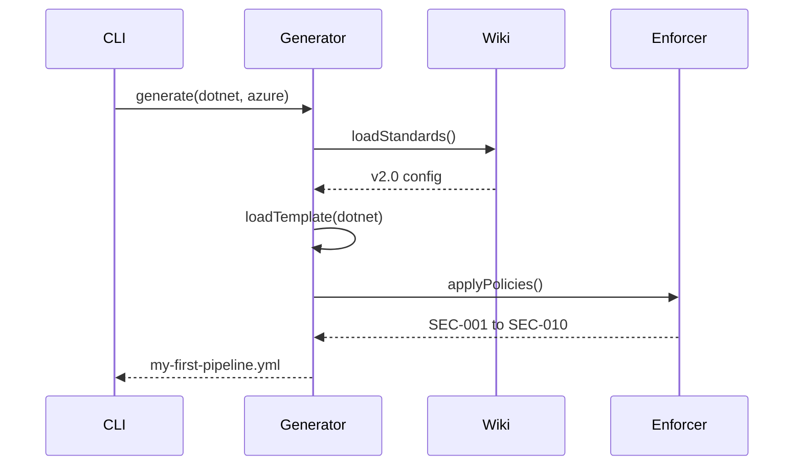

**View the result:**
```bash
cat my-first-pipeline.yml
```

### Exercise 1.2: Generate Pipeline with Azure Services

```bash
node dist/cli/pipeline-assistant.js generate \
  --platform azure-devops \
  --type dotnet \
  --services redis,azuresql \
  --env production \
  --output pipeline-with-services.yml
```

**Additional configuration included:**
- Azure SQL connection strings
- Redis cache configuration
- Key Vault integration for secrets
- Environment-specific settings

### Exercise 1.3: Generate Node.js Pipeline for GitHub Actions

```bash
node dist/cli/pipeline-assistant.js generate \
  --platform github-actions \
  --type node \
  --services cosmosdb,servicebus \
  --output pipeline-nodejs.yml
```

**Platform differences:**

| Feature | Azure DevOps | GitHub Actions |
|---------|-------------|----------------|
| Syntax | `task: TaskName@1` | `uses: action@v4` |
| Setup | `NodeTool@0` | `actions/setup-node@v4` |
| Cache | `Cache@2` | `actions/cache@v4` |
| Artifacts | `PublishBuildArtifacts@1` | `actions/upload-artifact@v4` |

### Exercise 1.4: View All Options

```bash
node dist/cli/pipeline-assistant.js generate --help
```

**Available options:**
```
--platform <platform>  Target platform (azure-devops|github-actions) [required]
--type <type>          Project type (dotnet|node|python|java|go)
--services <services>  Azure services (redis,azuresql,keyvault,cosmosdb,servicebus,storage)
--env <environment>    Target environment (dev|staging|production)
--output <file>        Output file path
--strict               Apply strict validation rules
```

### Checkpoint 1

**What we learned:**
- Automatic pipeline generation with security built-in
- Multi-platform support (Azure DevOps and GitHub Actions)
- Service integration (Redis, SQL, CosmosDB, etc.)
- All SEC-* policies applied automatically

---

## 6. Lab 2: Pipeline Analysis

### Objective

Learn to detect security, compliance, and performance issues in existing pipelines.

### Exercise 2.1: Analyze Problematic Pipeline

```bash
# View the problematic pipeline
cat docs/examples/problematic/hardcoded-secrets.yml

# Analyze it
node dist/cli/pipeline-assistant.js analyze \
  -f docs/examples/problematic/hardcoded-secrets.yml
```

**Expected output:**
```
Pipeline Analysis Report
========================

Compliance Score: 25/100

Critical Issues (5):
- [SEC-001] Hardcoded secrets detected in variables
- [SEC-002] No security scanning stage
- [SEC-003] Missing secret scanning (TruffleHog)
- [POL-001] Missing mandatory security stage
- [POL-002] No approval gates for production

Medium Issues (3):
- [PERF-001] No cache configuration
- [QUAL-001] Tests don't generate coverage report
- [QUAL-002] No code quality checks

Low Issues (2):
- [DOC-001] Missing stage descriptions
- [CONF-001] Trigger not properly configured
```

### Exercise 2.2: Analyze Corrected Pipeline

```bash
node dist/cli/pipeline-assistant.js analyze \
  -f docs/examples/correct/dotnet-basic.yml
```

**Expected output:**
```
Pipeline Analysis Report
========================

Compliance Score: 95/100

No critical issues found!

Recommendations (2):
- Consider adding deployment slots for zero-downtime deployments
- Add integration test stage for end-to-end validation
```

### Exercise 2.3: Compare Before/After

```bash
diff docs/examples/problematic/hardcoded-secrets.yml \
     docs/examples/correct/dotnet-basic.yml
```

### Checkpoint 2

**What we learned:**
- Pipeline security and compliance analysis
- Understanding compliance scores (0-100)
- Issue severity levels (Critical/Medium/Low)
- Improvement recommendations

---

## 7. Lab 3: Wiki & Standards Management

### Objective

Learn to manage corporate standards and view adoption metrics.

### Exercise 3.1: View Available Standards

```bash
node dist/cli/wiki-cli.js standards --list
```

**Expected output includes:**
- Mandatory rules (must implement)
- Recommended rules (should implement)
- Forbidden practices (must not use)

### Exercise 3.2: View Pipeline Templates

```bash
node dist/cli/wiki-cli.js templates --list
```

### Exercise 3.3: View Adoption Metrics

```bash
node dist/cli/wiki-cli.js metrics --current
```

### Exercise 3.4: Explore Wiki Structure

```bash
# View v2.0 structure
ls -la wiki/standards/

# View security policies
cat wiki/standards/security/policies.yaml

# View mandatory stages
cat wiki/standards/core/stages.yaml

# View quality gates
cat wiki/standards/quality/gates.yaml
```

### Checkpoint 3

**What we learned:**
- Wiki-driven standards management
- v2.0 directory structure
- Security policies configuration
- Adoption metrics tracking

---

## 8. Lab 4: VS Code Extension

### Objective

Experience real-time analysis and quick fixes directly in VS Code.

### Step 1: Build the Extension Package

```bash
cd vscode-extension
npm install
npm run compile
npx vsce package
cd ..
```

This creates `pipeline-assistant-vscode-1.0.0.vsix`.

### Step 2: Install the Extension

**Option A: Via Command Line**
```bash
code --install-extension vscode-extension/pipeline-assistant-vscode-1.0.0.vsix
```

**Option B: Via VS Code UI**
1. Open VS Code
2. Go to Extensions view (`Cmd+Shift+X` / `Ctrl+Shift+X`)
3. Click `...` menu → "Install from VSIX..."
4. Select `vscode-extension/pipeline-assistant-vscode-1.0.0.vsix`

### Step 3: Reload VS Code

After installation, reload VS Code:
- Press `Cmd+Shift+P` / `Ctrl+Shift+P`
- Type "Reload Window" and select it

### Step 4: Experience Real-Time Analysis

1. Open `docs/examples/problematic/hardcoded-secrets.yml`
2. See red underlines on problematic lines
3. Hover for issue descriptions
4. Click lightbulb for quick fixes

### Step 5: Use Snippets

Create a new file and try:
- `stage-security` - Complete security stage
- `stage-build-dotnet` - .NET build stage
- `stage-test-coverage` - Test with coverage

### Checkpoint 4

**What we learned:**
- VS Code extension installation
- Real-time problem detection
- Quick fixes and snippets
- Available commands

---

## 9. Lab 5: MCP Server Integration

### Objective

Use Pipeline Assistant with Claude Desktop via Model Context Protocol.

### Step 1: Configure Claude Desktop

**macOS:** `~/Library/Application Support/Claude/claude_desktop_config.json`
**Windows:** `%APPDATA%\Claude\claude_desktop_config.json`

```json
{
  "mcpServers": {
    "pipeline-assistant": {
      "command": "node",
      "args": ["dist/src/server.js"],
      "cwd": "/absolute/path/to/pipeline-assistant-mcp"
    }
  }
}
```

### Step 2: Restart Claude Desktop

Close and reopen Claude Desktop for changes to take effect.

### Step 3: Test the Integration

Try these prompts in Claude Desktop:

**Generate a pipeline:**
```
Generate a Node.js pipeline for production with Redis and Azure SQL.
Include security scanning and deployment approval gates.
```

**Analyze a pipeline:**
```
Analyze this pipeline for security issues:

variables:
  DB_PASSWORD: 'supersecret123'

stages:
  - stage: Build
    jobs:
      - job: BuildJob
        steps:
          - script: npm install
```

### Checkpoint 5

**What we learned:**
- MCP Server configuration
- Natural language pipeline generation
- AI-powered analysis and suggestions

---

## 10. Lab 6: Azure DevOps Integration

### Objective

Set up automated PR analysis in Azure DevOps.

### Step 1: Create Personal Access Token

1. Go to Azure DevOps > Profile > Security
2. Create new token with scopes:
   - Code: Read & Write
   - Pull Request Threads: Read & Write

### Step 2: Configure Environment

```bash
export AZDO_ORG_URL="https://dev.azure.com/your-org"
export AZDO_PAT="your-personal-access-token"
export AZDO_PROJECT="YourProject"
```

### Step 3: Test Connection

```bash
curl -u ":$AZDO_PAT" \
  "$AZDO_ORG_URL/_apis/projects?api-version=7.0"
```

### Step 4: Simulate PR Analysis

```bash
# Simulate a bad pipeline PR
node dist/cli/pr-bot-cli.js simulate --scenario bad

# Simulate a good pipeline PR
node dist/cli/pr-bot-cli.js simulate --scenario good
```

### Checkpoint 6

**What we learned:**
- Azure DevOps authentication
- PR analysis from CLI
- Enforcement modes (learning vs enforcement)

---

## 11. Lab 7: GitHub Integration

### Objective

Set up automatic pipeline analysis in GitHub PRs.

### Step 1: Create GitHub Workflow

Create `.github/workflows/pipeline-review.yml`:

```yaml
name: Pipeline Review

on:
  pull_request:
    paths:
      - '**.yml'
      - '**.yaml'

jobs:
  analyze:
    runs-on: ubuntu-latest
    steps:
      - uses: actions/checkout@v4

      - uses: actions/setup-node@v4
        with:
          node-version: '20'

      - name: Clone Pipeline Assistant
        run: |
          git clone https://github.com/soydachi/pipeline-assistant-mcp.git /tmp/pa
          cd /tmp/pa && npm install && npm run build

      - name: Analyze Pipelines
        env:
          GITHUB_TOKEN: ${{ secrets.GITHUB_TOKEN }}
        run: |
          for file in $(find . -name "*.yml" -o -name "*.yaml"); do
            echo "Analyzing: $file"
            node /tmp/pa/dist/cli/pipeline-assistant.js analyze "$file"
          done
```

### Checkpoint 7

**What we learned:**
- GitHub Actions workflow setup
- Automatic PR analysis
- GitHub token integration

---

## 12. Advanced Topics

### Custom Policy Creation

Edit `wiki/standards/security/policies.yaml` to add custom policies:

```yaml
policies:
  - id: SEC-CUSTOM-001
    name: Custom Security Check
    description: Your organization-specific requirement
    category: custom
    severity: HIGH
    level: mandatory
    stage: security
    tools:
      primary: CustomTool
```

### Template Customization

Create templates in `wiki/standards/platforms/azure/templates/`:

```yaml
# custom-technology.yml
trigger:
  branches:
    include:
      - main

stages:
  - stage: Validate
    # ... your custom stages
```

### Metrics and Reporting

```bash
# Generate compliance report
node dist/cli/wiki-cli.js metrics \
  --report markdown \
  --export compliance-report.md

# Track adoption over time
node dist/cli/wiki-cli.js metrics --history
```

---

## 13. Next Steps

### What You've Learned

- Pipeline generation with security built-in
- Security and compliance analysis
- Wiki-driven standards management
- VS Code extension for real-time analysis
- MCP integration with Claude Desktop
- Azure DevOps and GitHub automation

### Explore Further

1. **Customize Standards**
   - Edit `wiki/standards/security/policies.yaml`
   - Add organization-specific requirements
   - Create custom templates

2. **Run Full Test Suite**
   ```bash
   npm test
   npx vitest run --coverage
   ```

3. **Contribute**
   - Check [CONTRIBUTING.md](../CONTRIBUTING.md)
   - Look for issues labeled "good first issue"

### Resources

- [Usage Guide](USAGE.md) - Complete reference
- [Contributing Guide](../CONTRIBUTING.md) - How to contribute
- [Changelog](../CHANGELOG.md) - Version history
- [GitHub Issues](https://github.com/soydachi/pipeline-assistant-mcp/issues)

### Contact

**Dachi Gogotchuri** ([@soydachi](https://github.com/soydachi))
- Website: [soydachi.com](https://soydachi.com)
- LinkedIn: [Dachi Gogotchuri](https://linkedin.com/in/soydachi)

---

**Congratulations!** You've completed the Pipeline Assistant MCP workshop.
